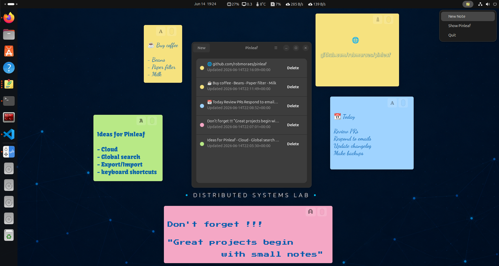

# Pinleaf

Pinleaf is a local-first desktop sticky notes app for Ubuntu-first,
GNOME-style Linux desktops, built with Python, GTK 4 and libadwaita.

Project page: [https://robmoraes.github.io/pinleaf/](https://robmoraes.github.io/pinleaf/)



## Supported Platform

Primary target:

- Ubuntu 24.04 LTS with GNOME or GNOME-style desktop sessions.

Supported install path:

- Ubuntu 24.04 through the Launchpad PPA `ppa:robmoraes/pinleaf`.

Expected runtime requirements:

- Python 3;
- GTK 4;
- libadwaita;
- PyGObject;
- Ayatana AppIndicator support.

Best-effort:

- other Debian/Ubuntu-compatible systems where the same dependencies are
  available.

Not currently validated:

- Fedora, Arch, openSUSE or other non-Debian distributions;
- KDE, Xfce, LXQt or other non-GNOME desktop behavior;
- Flatpak, Snap or AppImage packaging;
- macOS or Windows.

See [Known Limitations](docs/known-limitations.md) for desktop-environment and
packaging notes.

The current MVP supports:

- independent post-it-style note windows;
- local SQLite persistence;
- autosave while typing;
- note colors;
- a main panel with note previews;
- an AppIndicator status menu for quick actions;
- an About dialog with maintainer, license and font credits;
- bundled handwriting-style fonts;
- bundled app/tray icon assets;
- Ubuntu PPA and local Debian package installation.

## Install

### Ubuntu PPA

On Ubuntu 24.04, add the Pinleaf PPA and install with `apt`:

```bash
sudo add-apt-repository ppa:robmoraes/pinleaf
sudo apt update
sudo apt install pinleaf
```

After installation, updates are handled by the normal system update flow:

```bash
sudo apt update
sudo apt upgrade
```

Remove the package:

```bash
sudo apt remove pinleaf
```

Removing the package does not remove note data under `~/.local/share/pinleaf`.

### Debian/Ubuntu Release Package

Download the `pinleaf_*.deb` package from the release artifacts, then install it
with `apt`:

```bash
sudo apt install ./pinleaf_*.deb
```

This installs:

- `/usr/bin/pinleaf`
- `/usr/share/applications/dev.pinleaf.Pinleaf.desktop`
- Pinleaf icons under `/usr/share/icons/hicolor`
- Pinleaf Python package files and bundled resources

Remove the package:

```bash
sudo apt remove pinleaf
```

Removing the package does not remove note data under `~/.local/share/pinleaf`.

If `apt` reports that the local package download is performed unsandboxed
because the `_apt` user cannot access the `.deb`, move or copy the package to a
world-readable directory such as `/tmp` and install it from there:

```bash
cp pinleaf_*.deb /tmp/
sudo apt install /tmp/pinleaf_*.deb
```

## Development Setup

Install the system dependencies for Python, GTK 4, libadwaita and the
AppIndicator helper.

On Ubuntu 24.04:

```bash
sudo apt install \
  python3-gi \
  gir1.2-gtk-4.0 \
  gir1.2-adw-1 \
  gir1.2-ayatanaappindicator3-0.1 \
  libayatana-appindicator3-1
```

Clone the repository and run the app from the project root:

```bash
git clone https://github.com/<owner>/pinleaf.git
cd pinleaf
/usr/bin/python3 -m pinleaf
```

For isolated development data, set `XDG_DATA_HOME`:

```bash
XDG_DATA_HOME=/tmp/pinleaf-dev /usr/bin/python3 -m pinleaf
```

Pinleaf stores notes under:

```text
~/.local/share/pinleaf/pinleaf.sqlite3
```

or under:

```text
$XDG_DATA_HOME/pinleaf/pinleaf.sqlite3
```

## Local Desktop Install

For a user-local desktop launcher, run from the repository root:

```bash
scripts/install-local
```

This installs:

- `~/.local/bin/pinleaf`
- `~/.local/share/applications/dev.pinleaf.Pinleaf.desktop`
- Pinleaf icons under `~/.local/share/icons/hicolor`

The local install points to the current source checkout. If you move the
repository, run `scripts/install-local` again.

To remove the local launcher and icons:

```bash
scripts/uninstall-local
```

Uninstalling does not remove note data.

## Local Debian Package

Maintainers can build the local Debian package from the repository root.

Install packaging tools:

```bash
sudo apt install build-essential debhelper dpkg-dev
```

Build the package from the repository root:

```bash
dpkg-buildpackage -us -uc
```

Install the generated package from the parent directory:

```bash
sudo apt install ../pinleaf_*.deb
```

## Release

Maintainers publish downloadable Debian package artifacts through GitHub
Releases and publish Ubuntu packages through the Launchpad PPA.

After merging the release changes into `main`, create and push a version tag:

```bash
git switch main
git pull
git tag v0.7.0
git push origin v0.7.0
```

The release workflow runs on `v*` tags. It runs tests, builds the local Debian
package, creates or updates the matching GitHub Release, and uploads:

- `pinleaf_*.deb`
- `pinleaf_*.buildinfo`
- `pinleaf_*.changes`

### Ubuntu PPA Upload

Maintainers publish the PPA package by uploading a signed source package to
Launchpad:

```bash
debuild -S -kC8F3D9976DEDB74C5C31BFC87854367646319599
dput ppa:robmoraes/pinleaf ../pinleaf_0.7.0_source.changes
```

The PPA target for the first upload is Ubuntu 24.04 LTS (`noble`).

See [Manual Launchpad PPA Publication](docs/release/launchpad-ppa.md) for the
full maintainer terminal workflow.

## Test

```bash
/usr/bin/python3 -m unittest discover -s tests
/usr/bin/python3 -m compileall pinleaf tests
```

## Project Structure

```text
pinleaf/
  app.py                  GTK/libadwaita application lifecycle
  config.py               paths and resources
  fonts.py                bundled font registration
  models.py               note domain model
  storage/                SQLite schema and repository
  services/               note service and autosave
  ui/                     GTK windows, dialogs and tray controller
  resources/              CSS, fonts and icons
docs/.specs/001-desktop-sticky-notes/
  spec.md
  plan.md
  tasks.md
```

## Known Limitations

See [Known Limitations](docs/known-limitations.md).

## Fonts

Bundled fonts live in `pinleaf/resources/fonts/`.

The included Google Fonts families are distributed under the SIL Open Font
License. Their `OFL.txt` files are kept beside each font family.

## License

Pinleaf source code is licensed under the MIT License. See [LICENSE](LICENSE).
